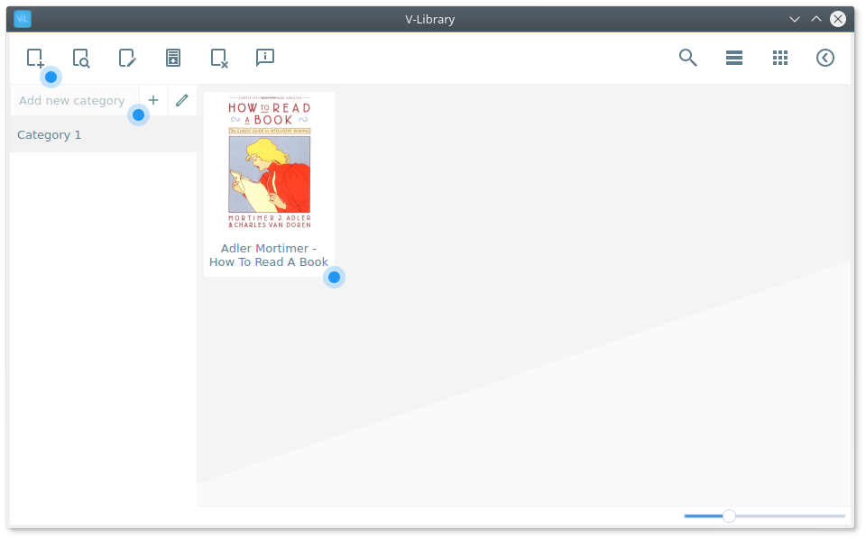
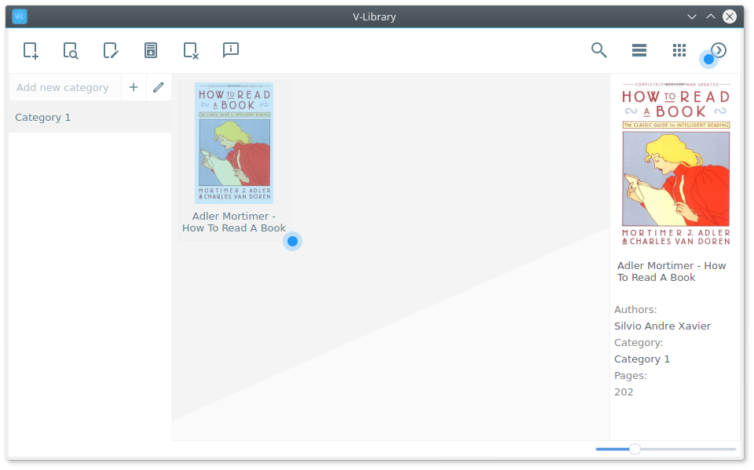
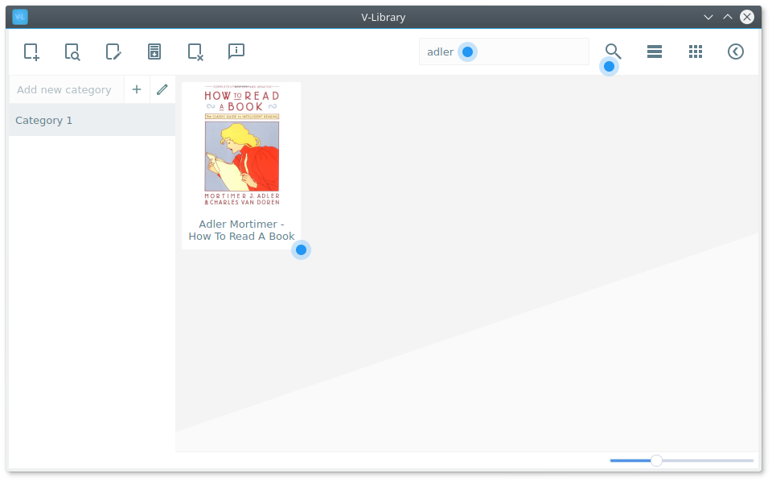
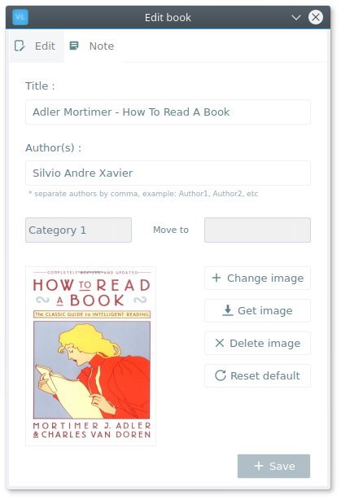
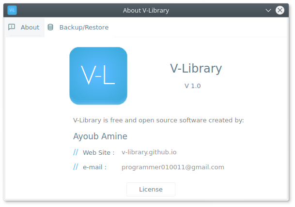

# V-Library

V-Library is a free and open source software for organize your books (at now .pdf).

### Basic Features :

- Create the categories with name and image.
- Edit book information.
- Search a specific book.
- Move book from category to another category.
- Backup and Restore categories with books.
- Simplified graphical user interface + Responsive.

### Install :

Windows (64 bit): [V-Library-x64](https://github.com/ayoubamine/V-Library/raw/master/dist/V-Library_x64_setup.exe)

*Ghostscript* and *ImageMagick* is requires to work V-Library, So you have to install it as well:

Ghostscript (32 bit): [gs-x86](https://github.com/ArtifexSoftware/ghostpdl-downloads/releases/download/gs921/gs921w32.exe)

Ghostscript (64 bit): [gs-x64](https://github.com/ArtifexSoftware/ghostpdl-downloads/releases/download/gs921/gs921w64.exe)

ImageMagick (32 bit): [ImageMagick-x86](http://www.imagemagick.org/download/binaries/ImageMagick-6.9.9-5-Q16-x86-dll.exe)

ImageMagick (64 bit): [ImageMagick-x64](http://www.imagemagick.org/download/binaries/ImageMagick-6.9.9-5-Q16-x64-dll.exe)

Debian/Ubuntu: `sudo apt-get install libmagickwand-dev`

Fedora/CentOS: `dnf install ImageMagick-devel`

### Screenshots :

### License :

The V-Library code is released under GNU GPLv3.
